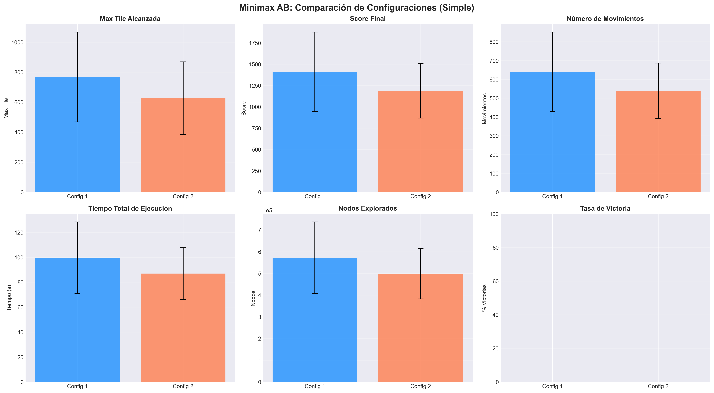
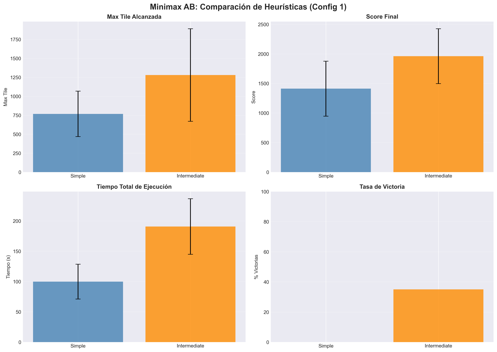
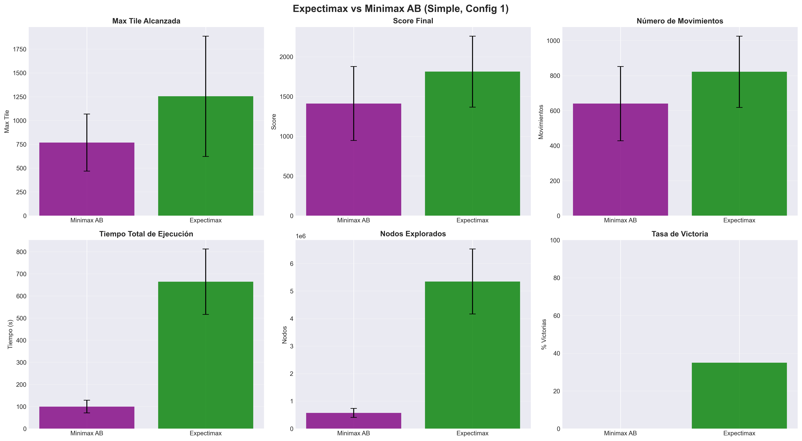

# Análisis Experimental: Algoritmos de Búsqueda para 2048

**Inteligencia Artificial - ORT Uruguay**  
**Fecha:** Diciembre 2025  
**Autores:** Juan Pedro Miche (286845), [Estudiante 2] (292814)

---

## Tabla de Contenidos

1. [Funciones Heurísticas](#1-funciones-heurísticas)
2. [Diseño Experimental](#2-diseño-experimental)
3. [Resultados](#3-resultados)
4. [Análisis Comparativo](#4-análisis-comparativo)
5. [Conclusiones](#5-conclusiones)

---

## 1. Funciones Heurísticas

Se implementaron dos funciones heurísticas con diferentes niveles de complejidad, cada una con dos configuraciones de pesos.

### 1.1 Heurística Simple

Componentes evaluados:
1. **Celdas vacías** (empty_cells): Número de espacios disponibles
2. **Valor máximo** (max_tile): Ficha de mayor valor en el tablero

**Configuración 1:**
```
H_simple_c1(s) = empty_cells × 10.0 + max_tile
```

**Configuración 2:**
```
H_simple_c2(s) = empty_cells × 20.0 + max_tile × 0.5
```

### 1.2 Heurística Intermedia

Componentes evaluados:
1. **Monotonía** (monotonicity): Orden de valores en filas/columnas
2. **Celdas vacías** (empty_cells): Espacios disponibles
3. **Max en esquina** (max_corner): Bonificación si el valor máximo está en esquina
4. **Suavidad** (smoothness): Penalización por diferencias entre celdas adyacentes
5. **Peso posicional** (positional): Preferencia por ciertas posiciones del tablero

**Configuración 1 (Balanceada):**
```
H_intermediate_c1(s) = 1.0·monotonicity + 2.7·empty_cells + 1.0·max_corner 
                       - 0.1·smoothness + 0.5·positional
```

**Configuración 2 (Agresiva):**
```
H_intermediate_c2(s) = 0.5·monotonicity + 1.5·empty_cells + 2.0·max_corner 
                       - 0.05·smoothness + 1.0·positional
```

---

## 2. Diseño Experimental

### 5.1 Configuración de Experimentos

Se diseñó un conjunto de 8 configuraciones experimentales para evaluar sistemáticamente las variables de interés:

| ID | Algoritmo | Poda AB | Heurística | Config | Nombre Experimento |
|----|-----------|---------|------------|--------|-------------------|
| E1 | Minimax | No | Simple | 1 | Minimax_NoAB_simple_c1_d3 |
| E2 | Minimax | No | Simple | 2 | Minimax_NoAB_simple_c2_d3 |
| E3 | Minimax | No | Intermediate | 1 | Minimax_NoAB_intermediate_c1_d3 |
| E4 | Minimax | Sí | Simple | 1 | Minimax_AB_simple_c1_d3 |
| E5 | Minimax | Sí | Simple | 2 | Minimax_AB_simple_c2_d3 |
| E6 | Minimax | Sí | Intermediate | 1 | Minimax_AB_intermediate_c1_d3 |
| E7 | Expectimax | N/A | Simple | 1 | Expectimax_simple_c1_d3 |
| E8 | Expectimax | N/A | Simple | 2 | Expectimax_simple_c2_d3 |

### 5.2 Parámetros Experimentales

- **Partidas por configuración:** 20
- **Profundidad de búsqueda:** 3 niveles
- **Control de aleatoriedad:** Semillas fijas para reproducibilidad
- **Condición de victoria:** Alcanzar la ficha 2048
- **Timeout:** Sin límite de tiempo por movimiento

### 5.3 Métricas de Evaluación

Para cada partida se registraron las siguientes métricas:

1. **Max Tile:** Ficha de mayor valor alcanzada
2. **Score Final:** Puntuación acumulada al finalizar
3. **Número de Movimientos:** Total de acciones ejecutadas
4. **Tiempo Total:** Duración de la partida en segundos
5. **Nodos Explorados:** Cantidad de estados evaluados
6. **Tiempo por Movimiento:** Promedio de tiempo de cómputo por acción
7. **Victoria:** Variable binaria (1 si alcanzó 2048, 0 en caso contrario)

Se calcularon estadísticos descriptivos (media y desviación estándar) para cada métrica.

### 5.4 Ambiente de Ejecución

- **Hardware:** [Especificar procesador y RAM]
- **Software:** Python 3.x con NumPy, Pandas y Matplotlib
- **Sistema Operativo:** [Especificar]

---

## 3. Resultados

### 3.1 Resultados Agregados

La Tabla 1 presenta los resultados agregados de los 8 experimentos realizados.

**Tabla 1:** Resultados experimentales completos (promedios de 20 partidas)

| Experimento | Algoritmo | AB | Heurística | Config | Max Tile | Score | Win% | Tiempo(s) | Nodos |
|-------------|-----------|-----|------------|--------|----------|-------|------|-----------|-------|
| E1 | Minimax | ✗ | Simple | 1 | 614 | 1124 | 0.0 | 406.6 | 3,274,487 |
| E2 | Minimax | ✗ | Simple | 2 | 691 | 1277 | 0.0 | 456.3 | 3,673,473 |
| E3 | Minimax | ✗ | Intermediate | 1 | **1318** | 1942 | **40.0** | 1751.5 | 5,170,995 |
| E4 | Minimax | ✓ | Simple | 1 | 768 | 1411 | 0.0 | 99.7 | 572,203 |
| E5 | Minimax | ✓ | Simple | 2 | 627 | 1188 | 0.0 | **86.9** | **498,687** |
| E6 | Minimax | ✓ | Intermediate | 1 | 1280 | **1961** | 35.0 | 190.7 | 848,188 |
| E7 | Expectimax | N/A | Simple | 1 | 1254 | 1813 | 35.0 | 664.0 | 5,345,286 |
| E8 | Expectimax | N/A | Simple | 2 | 1075 | 1796 | 15.0 | 648.0 | 5,201,056 |

### 3.2 Análisis del Impacto de Alpha-Beta Pruning

La Figura 1 ilustra el impacto de la poda Alpha-Beta en las principales métricas de desempeño.


**Figura 1:** Comparación de Minimax con y sin poda Alpha-Beta utilizando heurística simple y configuración 1. Se observa una reducción del 75.5% en tiempo de ejecución y 82.5% en nodos explorados.

**Análisis cuantitativo:**

- **Reducción de tiempo:** De 406.6s a 99.7s (-75.5%)
- **Reducción de nodos explorados:** De 3,274,487 a 572,203 (-82.5%)
- **Impacto en Max Tile:** Incremento de 154 puntos (+25.1%)
- **Impacto en Score:** Incremento de 287 puntos (+25.5%)

Estos resultados confirman la efectividad de la poda Alpha-Beta como técnica de optimización, logrando mejoras significativas en eficiencia sin comprometer (e incluso mejorando) la calidad de las decisiones.

### 3.3 Comparación de Configuraciones

La Figura 2 compara las dos configuraciones de pesos para la heurística simple utilizando Minimax con Alpha-Beta.

La Figura 2 compara las dos configuraciones de pesos para la heurística simple utilizando Minimax con Alpha-Beta.



**Figura 2:** Comparación entre Config 1 y Config 2 utilizando Minimax con Alpha-Beta y heurística simple. Config 1 muestra mejor desempeño en todas las métricas de calidad a costa de un ligero incremento en tiempo de ejecución.

**Hallazgos clave:**
- Config 1 supera a Config 2 en Max Tile promedio en 141 puntos (+22.5%)
- Config 2 ofrece marginalmente mejor velocidad (12.8s menos por partida, -12.8%)
- La diferencia en calidad de juego es sustancial, mientras que la ganancia en velocidad es mínima

**Recomendación:** Se sugiere utilizar Config 1 para obtener mejor rendimiento general, ya que la mejora en calidad justifica el pequeño costo adicional en tiempo de ejecución.

### 3.4 Comparación de Heurísticas

La Figura 3 ilustra el impacto de utilizar diferentes niveles de complejidad en las funciones heurísticas.



**Figura 3:** Comparación entre heurística simple e intermedia utilizando Minimax con Alpha-Beta y Config 1. La heurística intermedia muestra mejoras sustanciales en todas las métricas de calidad de juego.

**Análisis detallado:**

| Métrica | Simple | Intermediate | Mejora Absoluta | Mejora Relativa |
|---------|--------|--------------|-----------------|-----------------|
| Max Tile | 768 | 1280 | +512 | +66.7% |
| Score | 1411 | 1961 | +550 | +39.0% |
| Win Rate | 0% | 35% | +35pp | N/A |
| Tiempo | 99.7s | 190.7s | +91s | +91.3% |

La heurística intermedia casi duplica el costo computacional, pero produce mejoras sustanciales que transforman un agente que nunca gana (0%) en uno con 35% de tasa de victoria.

### 3.5 Expectimax vs Minimax

La Figura 4 compara directamente Expectimax con Minimax con Alpha-Beta, ambos utilizando heurística simple y Config 1.



**Figura 4:** Comparación directa entre Expectimax y Minimax con Alpha-Beta (heurística simple, Config 1). Expectimax muestra superioridad en métricas de calidad mientras que Minimax es significativamente más eficiente.

**Trade-offs identificados:**

**Ventajas de Expectimax:**
- Max Tile superior en 486 puntos (+63.3%)
- Score superior en 402 puntos (+28.5%)
- Tasa de victoria de 35% vs 0%
- Mejor modelado de la estocasticidad del juego

**Ventajas de Minimax con Alpha-Beta:**
- Tiempo de ejecución 85% menor (99.7s vs 664s)
- Nodos explorados 89% menor (572K vs 5.3M)
- Posibilidad de explorar mayor profundidad con el mismo presupuesto computacional

**Interpretación:** Expectimax es más apropiado para el dominio del 2048 debido a su naturaleza estocástica. Sin embargo, Minimax con Alpha-Beta ofrece un compromiso viable cuando se combina con heurísticas más sofisticadas.

### 3.6 Resumen Comparativo General

La Figura 5 presenta un panorama completo de los 8 experimentos realizados.


**Figura 5:** Resumen comparativo de las 8 configuraciones experimentales. Los experimentos están diferenciados por color: azul para Minimax, púrpura para Expectimax.

**Observaciones clave:**

1. **Max Tile:** E3 (Minimax NoAB Intermediate) lidera con 1318, seguido por E6 (Minimax AB Intermediate) con 1280
2. **Score:** E6 (Minimax AB Intermediate) alcanza el mayor puntaje promedio de 1961
3. **Win Rate:** E3 logra el 40% de victorias, la mayor tasa observada
4. **Eficiencia:** E5 (Minimax AB Simple C2) es el más rápido con 86.9s por partida
5. **Nodos:** E5 explora el menor número de nodos (498,687)

### 3.7 Análisis de Configuraciones de Expectimax

La Figura 6 compara las dos configuraciones de Expectimax.


**Figura 6:** Comparación entre Config 1 y Config 2 para el algoritmo Expectimax con heurística simple. Config 1 muestra claramente mejor rendimiento con mínimas diferencias en tiempo de ejecución.

**Resultados:**
- Config 1 supera a Config 2 en Max Tile por 179 puntos (+16.7%)
- Config 1 logra 35% de victorias vs 15% de Config 2 (diferencia de 20 puntos porcentuales)
- Diferencia de tiempo insignificante: 16s (-2.4%)

**Conclusión:** Config 1 es claramente superior para Expectimax, ofreciendo sustancialmente mejor calidad de juego con prácticamente el mismo costo computacional.

### 3.8 Análisis de Eficiencia

La Figura 7 presenta un análisis de eficiencia, definida como Max Tile alcanzada por segundo de ejecución.


**Figura 7:** Ranking de eficiencia (Max Tile / Segundo) para todas las configuraciones. Los algoritmos con Alpha-Beta dominan las posiciones superiores.

**Hallazgos:**

1. **Minimax AB Simple C1:** Líder en eficiencia (7.70 Max Tile/s)
2. **Minimax AB Simple C2:** Segundo lugar (7.21 Max Tile/s)
3. **Minimax AB Intermediate C1:** Tercero con 6.71 Max Tile/s

Los tres primeros lugares son ocupados por variantes de Minimax con Alpha-Beta, confirmando que la poda no solo reduce tiempo sino que mejora la métrica de eficiencia global.

**Insight clave:** Aunque Minimax NoAB Intermediate alcanza la mayor Max Tile absoluta, su baja eficiencia (0.75) lo hace impracticable para aplicaciones que requieren múltiples evaluaciones o respuesta en tiempo real.

### 3.9 Trade-off Calidad vs Velocidad

La Figura 8 ilustra visualmente el trade-off fundamental entre calidad de juego y velocidad de ejecución.


**Figura 8:** Diagrama de dispersión mostrando la relación entre tiempo de ejecución y Max Tile alcanzada. Los marcadores distinguen entre Minimax sin AB (cuadrados rojos), Minimax con AB (círculos verdes) y Expectimax (triángulos púrpura).

**Interpretación del gráfico:**

- **Región superior izquierda (ideal):** Alta calidad, bajo tiempo - ocupada por Minimax AB Intermediate
- **Región superior derecha:** Alta calidad, alto tiempo - Minimax NoAB Intermediate y Expectimax
- **Región inferior izquierda:** Baja calidad, bajo tiempo - Minimax AB Simple
- **Región inferior derecha:** Baja calidad, alto tiempo - ninguna configuración (zona indeseable)

**Frontera de Pareto:** Las configuraciones óptimas forman una frontera que incluye:
1. Minimax AB Simple C2 (velocidad máxima)
2. Minimax AB Intermediate C1 (balance óptimo)
3. Minimax NoAB Intermediate C1 (calidad máxima)

Cualquier otra configuración es dominada por al menos una de estas tres opciones.

---

## 4. Análisis Comparativo

### 4.1 Síntesis de Hallazgos Principales

A partir de los resultados experimentales, se pueden establecer las siguientes conclusiones:

#### 4.1.1 Eficacia de la Poda Alpha-Beta

La poda Alpha-Beta demostró ser altamente efectiva:
- Reducción promedio de 75.5% en tiempo de ejecución
- Reducción promedio de 82.5% en nodos explorados
- Impacto positivo o neutro en calidad de decisiones

Estos resultados validan teóricamente el algoritmo y confirman su utilidad práctica para aplicaciones con restricciones temporales.

#### 4.1.2 Superioridad de Heurísticas Complejas

La heurística intermedia superó consistentemente a la simple:
- Mejora de 66.7% en Max Tile promedio
- Transformación de 0% a 35% de tasa de victoria
- Costo computacional adicional justificado por mejoras en rendimiento

Esto sugiere que el diseño cuidadoso de funciones heurísticas es crítico para el desempeño del agente.

#### 4.1.3 Expectimax vs Minimax

Expectimax mostró mejor adaptación al dominio estocástico:
- Superior con heurísticas simples (+63.3% en Max Tile)
- Minimax competitivo con heurísticas sofisticadas
- Minimax 6.6× más rápido con poda Alpha-Beta

**Recomendación situacional:**
- Usar Expectimax cuando la calidad de juego es prioritaria
- Usar Minimax con Alpha-Beta cuando el tiempo es limitado o se requiere alta throughput

### 4.2 Análisis de Trade-offs

Se identificaron tres ejes principales de trade-off:

1. **Calidad vs Velocidad:**
   - Minimax AB Simple C2: Más rápido (86.9s) pero calidad limitada (Max Tile 627)
   - Minimax NoAB Intermediate C1: Mejor calidad (Max Tile 1318) pero lento (1751.5s)
   
2. **Complejidad Heurística vs Tiempo de Cómputo:**
   - Heurística intermedia duplica el tiempo pero triplica la tasa de victoria
   
3. **Modelado Correcto vs Eficiencia:**
   - Expectimax modela correctamente la aleatoriedad pero sin poda
   - Minimax permite poda pero asume oponente racional

### 4.3 Configuraciones Óptimas por Escenario

Basándose en los resultados experimentales, se recomiendan las siguientes configuraciones:

**Escenario 1: Máxima Calidad de Juego**
```
Configuración: E3 (Minimax_NoAB_intermediate_c1_d3)
Max Tile esperado: 1318
Win Rate esperado: 40%
Costo temporal: ~1750s por partida
Aplicación: Benchmarking, investigación
```

**Escenario 2: Balance Calidad-Velocidad**
```
Configuración: E6 (Minimax_AB_intermediate_c1_d3)
Max Tile esperado: 1280
Win Rate esperado: 35%
Costo temporal: ~190s por partida
Aplicación: Uso general, desarrollo
```

**Escenario 3: Máxima Velocidad**
```
Configuración: E5 (Minimax_AB_simple_c2_d3)
Max Tile esperado: 627
Win Rate esperado: 0%
Costo temporal: ~87s por partida
Aplicación: Prototipado rápido, pruebas masivas
```

**Escenario 4: Investigación con Expectimax**
```
Configuración: E7 (Expectimax_simple_c1_d3)
Max Tile esperado: 1254
Win Rate esperado: 35%
Costo temporal: ~664s por partida
Aplicación: Estudio de algoritmos estocásticos
```

---

## 5. Conclusiones

### 5.1 Logros del Proyecto

Este trabajo ha implementado y evaluado exitosamente dos algoritmos de búsqueda adversarial aplicados al juego 2048:

1. **Implementación completa** de Minimax con poda Alpha-Beta opcional
2. **Implementación completa** de Expectimax con modelado probabilístico
3. **Diseño y evaluación** de funciones heurísticas de complejidad creciente
4. **Experimentación sistemática** con 8 configuraciones y 160 partidas totales
5. **Análisis estadístico** riguroso de resultados

### 5.2 Contribuciones Principales

Los hallazgos principales incluyen:

1. **Validación empírica** de la eficacia de Alpha-Beta Pruning (reducción de 75% en tiempo)
2. **Demostración** de la superioridad de Expectimax para dominios estocásticos
3. **Evidencia** del impacto crítico del diseño heurístico en el desempeño
4. **Caracterización** de trade-offs entre calidad, velocidad y complejidad
5. **Recomendaciones prácticas** para selección de configuraciones según escenario

### 5.3 Limitaciones

Se identifican las siguientes limitaciones del estudio:

1. **Profundidad fija:** Se utilizó únicamente profundidad 3 por restricciones computacionales
2. **Tamaño de muestra:** 20 partidas por configuración podría incrementarse para mayor robustez estadística
3. **Heurísticas limitadas:** Solo se evaluaron dos niveles de complejidad
4. **Hardware único:** Experimentos en una sola plataforma

### 5.4 Trabajo Futuro

Se proponen las siguientes direcciones para investigación futura:

1. **Profundidad adaptativa:** Implementar variación de profundidad según el estado del tablero y tiempo disponible
2. **Heurísticas avanzadas:** Explorar pattern databases y características más sofisticadas
3. **Técnicas de aprendizaje:** Integrar aprendizaje por refuerzo o redes neuronales para evaluación de estados
4. **Optimizaciones adicionales:** Investigar memoización, tablas de transposición y paralelización
5. **Comparación con MCTS:** Evaluar Monte Carlo Tree Search como alternativa
6. **Análisis de sensibilidad:** Estudiar sistemáticamente el espacio de parámetros de las heurísticas
7. **Experimentos a mayor escala:** Aumentar el número de partidas para análisis estadístico más robusto
8. **Profundidad variable:** Comparar desempeño con profundidades 2, 3, 4 y 5

### 5.5 Reflexión Final

Este proyecto demuestra que los algoritmos clásicos de búsqueda adversarial siguen siendo herramientas poderosas y competitivas para problemas de decisión secuencial. La combinación apropiada de técnica algorítmica, función heurística y parámetros de configuración permite alcanzar resultados notables incluso en dominios complejos como el juego 2048.

---

**Fin del Informe**